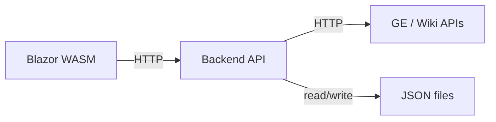

# dotnet-blazor-website

A .NET Blazor website (Blazor WebAssembly) with MudBlazor UI, pricing data demo, and sample pages. Built with C# and ASP.NET Core.
Visit the GitHub Pages site [kailabtw.github.io/dotnet-blazor-website/](https://kailabtw.github.io/dotnet-blazor-website/).

## Purpose

This project is a Blazor Web App used to explore Blazor layouts, MudBlazor components, and data-driven pages (e.g. Amazon-style price tracking with CSV and charts).

## Architecture

When running locally with the optional **Api** backend, the Blazor app calls the backend API, which fetches data from the RuneScape Grand Exchange (and optionally the wiki) and caches responses to JSON files on disk.



- **Blazor (frontend)**: Runs in the browser; uses a named `HttpClient` ("GeApi") to call the backend at `http://localhost:5041` when both are run locally.
- **Api (backend)**: ASP.NET Core minimal API; proxies GE catalogue, item detail, and graph endpoints; caches responses under `Api/Data/` as JSON.
- **GE features** (e.g. price tracking) only work when both the Blazor app and the Api project are running; the GitHub Pages–deployed site has no backend.

## GitHub Pages

This app is deployed as a **static Blazor WebAssembly** site to GitHub Pages using the workflow in `.github/workflows/deploy-gh-pages.yml`.  
Live URL (for this repo name):  
`https://kailabtw.github.io/dotnet-blazor-website/`

See **[docs/DEPLOY_ON_GH_PAGES.md](docs/DEPLOY_ON_GH_PAGES.md)** for the one‑time setup and how the workflow works.

## Quickstart (CLI)

You can run the app from the terminal without the VS Code C# extension.

**Prerequisites:** [.NET SDK](https://dotnet.microsoft.com/download) (check with `dotnet --version`).

From the project root:

```bash
dotnet restore
dotnet build
dotnet watch run
```

Then open **<http://localhost:5049>** (or the URL printed in the console) in a browser. Stop with `Ctrl+C`.

To use the **Grand Exchange price data** features, run the Api backend as well (in a second terminal): `cd Api && dotnet run`. The Api listens on `http://localhost:5041` and caches GE data to `Api/Data/` as JSON.

See **[docs/RUN_BLAZOR_CLI.md](docs/RUN_BLAZOR_CLI.md)** for more CLI options.
