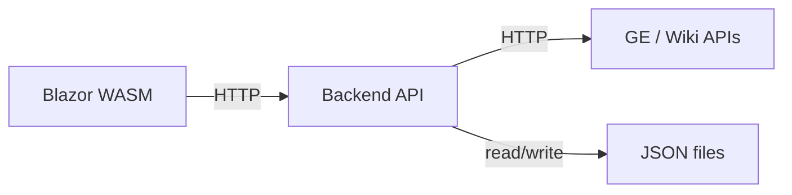

# dotnet-blazor-website

A .NET Blazor WebAssembly app with MudBlazor UI, pricing data demos, and sample pages.

**Live site:** [kailabtw.github.io/dotnet-blazor-price-tracker/](https://kailabtw.github.io/dotnet-blazor-price-tracker/)

## Purpose

Blazor layouts, MudBlazor components, and data-driven pages (e.g. Amazon-style price tracking with CSV and charts).

## GitHub Pages

Deployed as a **static Blazor WebAssembly** site via `.github/workflows/deploy-gh-pages.yml`.

- **URL:** `https://kailabtw.github.io/dotnet-blazor-price-tracker/`
- **Setup:** See [docs/DEPLOY_ON_GH_PAGES.md](docs/DEPLOY_ON_GH_PAGES.md) for one-time config and how the workflow works.

## Quickstart (CLI)

**Prerequisites:** [.NET SDK](https://dotnet.microsoft.com/download) (`dotnet --version`).

From the project root:

```bash
dotnet restore
dotnet build
dotnet watch run
```

Open **http://localhost:5049** (or the URL in the console). Stop with `Ctrl+C`.

More options: [docs/RUN_BLAZOR_CLI.md](docs/RUN_BLAZOR_CLI.md).

---

## Grand Exchange (GE) / Backend

Optional local backend for **RuneScape Grand Exchange** price data. The Blazor app calls the Api; the Api calls the GE (and optionally wiki) and caches responses as JSON on disk. GE features only work when both are running locally; the GitHub Pages site has no backend.

### Architecture



- **Blazor:** Uses a named `HttpClient` ("GeApi") to call the backend at `http://localhost:5041`.
- **Api:** ASP.NET Core minimal API; proxies GE catalogue, item detail, and graph endpoints; caches under `Api/Data/` as JSON.

### Run with GE

1. Start the Blazor app: `dotnet watch run` (from project root).
2. In a second terminal, start the Api: `cd Api && dotnet run` (listens on `http://localhost:5041`).

Then use GE price-tracking features in the app.
